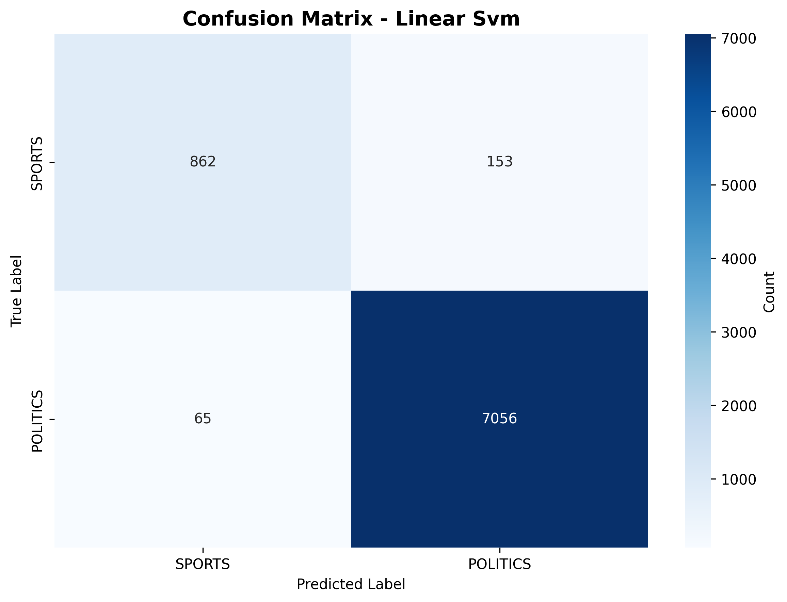
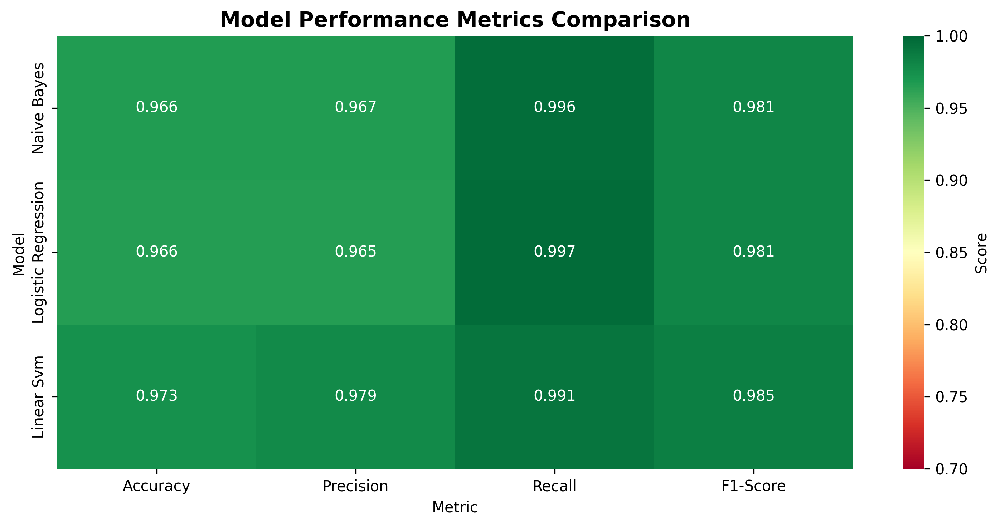
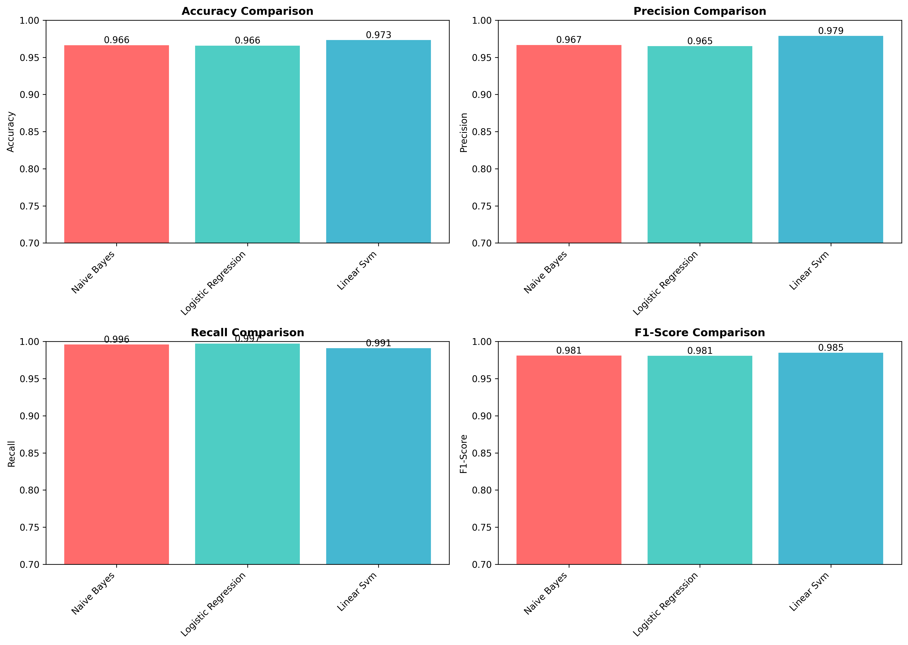

**Course:** Natural Language Understanding (NLU)  
**Student:** Neer Modi  
**Roll No:** B23CS1043  
**Date:** February 15, 2026

---

## Overview

This project builds a machine learning system to classify news articles into two categories: Sports and Politics. Using natural language processing techniques on 40,679 real news articles from HuffPost, the system achieved 97.32% accuracy with Linear SVM.

---

## Results

### Performance Summary

The best performing model was Linear SVM with the following metrics:

| Metric | Score |
|--------|-------|
| Accuracy | 97.32% |
| Precision | 97.88% |
| Recall | 99.09% |
| F1-Score | 98.48% |

### Model Comparison

| Model | Accuracy | Precision | Recall | F1-Score |
|-------|----------|-----------|--------|----------|
| Linear SVM | 97.32% | 97.88% | 99.09% | 98.48% |
| Naive Bayes | 96.64% | 96.67% | 99.59% | 98.11% |
| Logistic Regression | 96.58% | 96.51% | 99.71% | 98.08% |

### Confusion Matrix - Linear SVM



The confusion matrix shows that out of 8,136 test articles:
- 862 sports articles were correctly classified (84.9%)
- 7,056 politics articles were correctly classified (98.9%)
- Only 153 sports articles were misclassified as politics
- Only 65 politics articles were misclassified as sports

### Performance Metrics





### Other Models

For reference, the confusion matrices of other models are shown below:

**Naive Bayes Confusion Matrix**


**Logistic Regression Confusion Matrix**


---

## Dataset

The project uses the News Category Dataset v3 from Kaggle, containing articles published between 2012-2018. After filtering for only Sports and Politics categories, the dataset contained:

- **Total articles:** 40,679
- **Sports articles:** 5,077 (12.5%)
- **Politics articles:** 35,602 (87.5%)
- **Training set:** 32,543 articles (80%)
- **Test set:** 8,136 articles (20%)

---

## Methodology

### Data Preprocessing

The text preprocessing pipeline involves several steps:

1. **Lowercase conversion** - All text converted to lowercase
2. **URL and special character removal** - URLs, emails, and special characters removed
3. **Tokenization** - Text split into individual words
4. **Stopword removal** - Common English words (the, a, is, etc.) removed
5. **Lemmatization** - Words converted to base form (playing → play, better → good)
6. **Text reconstruction** - Processed tokens rejoined into text

Example:
```
Original: "Andrew McCutchen Wins 2012 NL MVP! Check @MLB for details..."
Processed: "andrew mccutchen win nml mvp check detail"
```

### Feature Engineering

Features were extracted using TF-IDF (Term Frequency-Inverse Document Frequency) vectorization with the following parameters:

- Maximum features: 5,000
- Minimum document frequency: 2
- Maximum document frequency: 95%
- N-gram range: unigrams only (single words)

This produced a sparse matrix of 40,679 articles × 5,000 features with 99.8% sparsity.

### Model Training

Three classification algorithms were trained and compared:

1. **Multinomial Naive Bayes** - Probabilistic classifier based on Bayes' theorem
2. **Logistic Regression** - Linear classifier using logistic function
3. **Linear SVM** - Support Vector Machine with linear kernel

The training data was split using stratified sampling to maintain the original class distribution in both training and test sets.

---

## Key Findings

All three models performed well on this classification task, with accuracy scores above 96%. The Linear SVM model achieved the best balance between precision and recall, making it suitable for production use.

The high performance is attributed to:
- Clear linguistic differences between sports and politics articles
- Effective text preprocessing pipeline
- Appropriate feature engineering with TF-IDF
- Stratified train-test split to handle class imbalance

---

## Conclusion

This project demonstrates that automated classification of news articles into sports and politics categories is achievable with high accuracy using standard machine learning techniques. The Linear SVM model with 97.32% accuracy provides a reliable system for this task.
