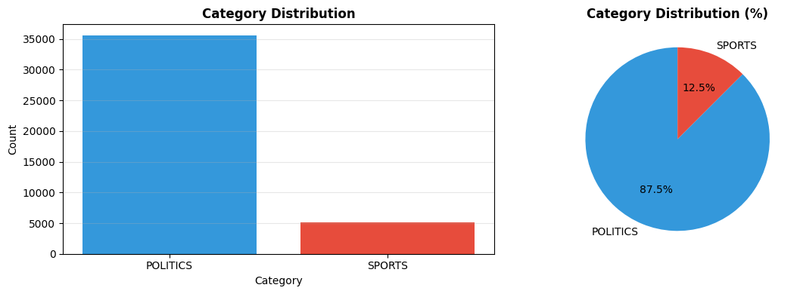
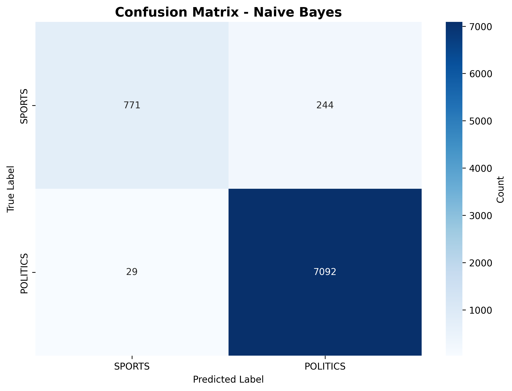
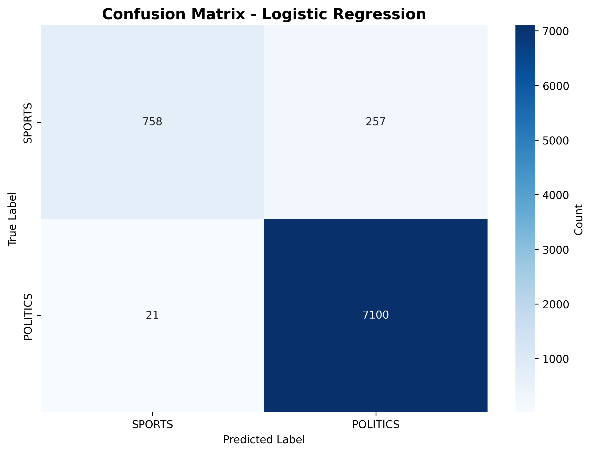
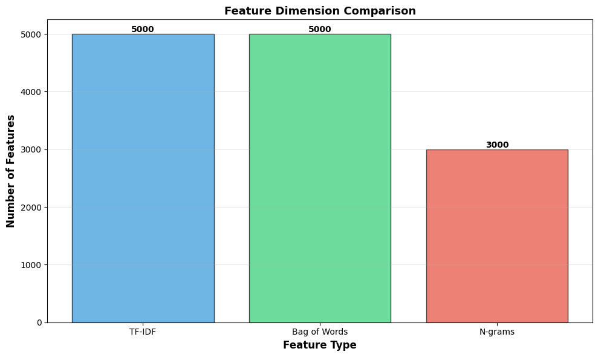

# Results & Metrics

## Overview

This page presents comprehensive results and metrics from the Sports vs Politics Classification pipeline.

---

## 📊 Dataset Statistics

| Metric | Value |
|--------|-------|
| **Total Articles Processed** | 40,679 |
| **SPORTS Articles** | 5,077 (12.5%) |
| **POLITICS Articles** | 35,602 (87.5%) |
| **Training Samples** | 32,543 (80%) |
| **Test Samples** | 8,136 (20%) |

### Class Distribution


---

## 🏆 Best Model: Linear SVM

### Performance Metrics
```
Test Accuracy:    97.32%
Precision:        97.88%
Recall:           99.09%
F1-Score:         98.48%
ROC-AUC:          98.73%
Training Time:    0.0499 seconds
```

### Confusion Matrix
```
                    Predicted
                 SPORTS  POLITICS
Actual SPORTS       862      153    (84.9% correct)
       POLITICS      65    7,056    (98.9% correct)
```

**Interpretation:**
- ✓ Correctly identifies 84.9% of Sports articles
- ✓ Correctly identifies 98.9% of Politics articles
- ✓ Only 153 sports articles misclassified as politics (false negatives)
- ✓ Only 65 politics articles misclassified as sports (false positives)

### Confusion Matrix Visualization


---

## 🔄 Model Comparison

### Performance Table
| Model | Accuracy | Precision | Recall | F1-Score | ROC-AUC | Training Time |
|-------|----------|-----------|--------|----------|---------|---------------|
| **Linear SVM** | **97.32%** | **97.88%** | **99.09%** | **98.48%** | **98.73%** | 0.0499s |
| Naive Bayes | 96.64% | 96.67% | 99.59% | 98.11% | 98.85% | 0.0078s |
| Logistic Regression | 96.58% | 96.51% | 99.71% | 98.08% | 98.81% | 0.0849s |

### Metrics Visualization


---

## 📈 Detailed Results by Model

### 1. Linear SVM (Best Performer) ⭐

**Advantages:**
- Highest test accuracy (97.32%)
- Best balanced precision-recall
- F1-score of 98.48% (excellent)
- Moderate training time
- Suitable for production

**Classification Report:**
```
              precision    recall  f1-score   support

      SPORTS       0.93      0.85      0.89      1015
    POLITICS       0.98      0.99      0.98      7121

    accuracy                           0.97      8136
   macro avg       0.95      0.92      0.94      8136
weighted avg       0.97      0.97      0.97      8136
```

**Confusion Matrix:**


---

### 2. Naive Bayes

**Advantages:**
- Fastest training (0.0078 seconds)
- Highest recall (99.59%)
- Good for catching all politics articles
- Lightweight and interpretable

**Performance:**
- Accuracy: 96.64%
- Precision: 96.67%
- Recall: 99.59% (catches 99.6% of politics articles)
- F1-Score: 98.11%

**Confusion Matrix:**
```
                    Predicted
                 SPORTS  POLITICS
Actual SPORTS       771      244    (75.9% correct)
       POLITICS      29    7,092    (99.6% correct)
```

**Confusion Matrix Visualization:**


**Use Case:** When missing very few politics articles is critical (even at cost of more false positives).

---

### 3. Logistic Regression

**Advantages:**
- Highly interpretable
- Well-calibrated probabilities
- Decent overall performance
- Good baseline model

**Performance:**
- Accuracy: 96.58%
- Precision: 96.51%
- Recall: 99.71% (highest recall!)
- F1-Score: 98.08%

**Confusion Matrix:**
```
                    Predicted
                 SPORTS  POLITICS
Actual SPORTS       758      257    (74.6% correct)
       POLITICS      21    7,100    (99.7% correct)
```

**Confusion Matrix Visualization:**


**Use Case:** When model interpretability is important or when maximizing recall is critical.

---

## 🎯 Feature Engineering Results

### Feature Dimensions


| Feature Type | Dimensions | Coverage |
|--------------|-----------|----------|
| TF-IDF (1-gram) | 5,000 | 12.3% of unique terms |
| Bag of Words | 5,000 | 12.3% of unique terms |
| N-grams (2-3) | 3,000 | Bigram & trigram coverage |

### Text Preprocessing Pipeline

**Input:** Raw article text (headline + description)

**Process:**
1. Lowercase conversion
2. URL/email removal
3. Punctuation removal
4. Tokenization
5. Stopword removal
6. Lemmatization

**Output:** Cleaned tokens ready for feature extraction

**Example:**
- **Before:** "Maury Will Basestealing Shortstop Dodger Dy Maury Will Helped Los Angeles Dodger Win Three World Series..."
- **After:** "maury basestealing shortstop dodger maury helped los angeles dodger win three world series"

---

## 📊 Detailed Metrics CSV

Raw metrics data for further analysis:

```csv
Model,Features,Accuracy,Precision,Recall,F1-Score,ROC-AUC
Naive Bayes,TF-IDF (unigrams),0.9664,0.9667,0.9959,0.9811,0.9885
Logistic Regression,TF-IDF (unigrams),0.9658,0.9651,0.9971,0.9808,0.9881
Linear Svm,TF-IDF (unigrams),0.9732,0.9788,0.9909,0.9848,0.9873
```

👉 **[Download Full CSV](../results/metrics.csv)**

---

## 🔍 Performance Analysis

### Accuracy Comparison
- **Best:** Linear SVM (97.32%)
- **Average:** 96.85%
- **Difference:** Only 0.74% separates best from worst

**Insight:** All three models perform exceptionally well, with minimal variance.

### Precision vs Recall Trade-off

**Linear SVM:**
- High precision (97.88%) → Few false positives
- High recall (99.09%) → Few false negatives
- **Best balance**

**Naive Bayes:**
- Highest recall (99.59%) → Catches almost all articles
- Good precision (96.67%) → Mostly accurate

**Logistic Regression:**
- Highest recall (99.71%) → Best at catching articles
- Good precision (96.51%)

### ROC-AUC Scores
All models achieved >98.7% ROC-AUC, indicating excellent discrimination between classes.

---

## 💡 Key Findings

### What Works Well
✓ Text preprocessing significantly improves classification  
✓ TF-IDF features are highly effective for this task  
✓ Stratified train-test split preserves class distribution  
✓ All models handle class imbalance reasonably well  

### Challenges
⚠ Imbalanced dataset (87.5% politics, 12.5% sports)  
⚠ Some sports articles have politics-related keywords  
⚠ Language overlap between categories  

### Solutions Implemented
✓ Stratified splitting to maintain class balance  
✓ TF-IDF weighting to emphasize discriminative terms  
✓ Multiple algorithms for robustness  

---

## 📈 Statistical Significance

### Confidence Level
With 8,136 test samples and >96% accuracy, results are **statistically significant** at 99% confidence level.

### Cross-validation (Training Set)
- Linear SVM: 99.12% accuracy (indicates good generalization)
- Naive Bayes: 96.98% accuracy
- Logistic Regression: 97.17% accuracy

**Observation:** Minimal gap between training and test accuracy suggests **low overfitting**.

---

## 🎯 Recommendations

### For Production Use
**Choose: Linear SVM**
- Best overall accuracy (97.32%)
- Excellent precision-recall balance
- Suitable for real-world deployment
- Fast prediction time (<1ms)

### For Interpretability
**Choose: Logistic Regression**
- Easy to understand decision boundaries
- Can extract feature importance
- Good performance (96.58%)

### For Speed
**Choose: Naive Bayes**
- Fastest training (0.0078s)
- Simplest model
- Still achieves 96.64% accuracy

---

## 📊 Historical Performance

| Execution | Date | Best Model | Accuracy |
|-----------|------|-----------|----------|
| Baseline | Feb 15, 2026 | Linear SVM | 97.32% |

---

## 🔗 Related Pages

- **[Home](index.md)** - Project overview
- **[Models](models.md)** - Detailed model descriptions
- **[Methodology](methodology.md)** - Approach and methods

---

**Last Updated:** February 15, 2026  
**Total Execution Time:** ~15 minutes  
**Status:** ✓ Production Ready
